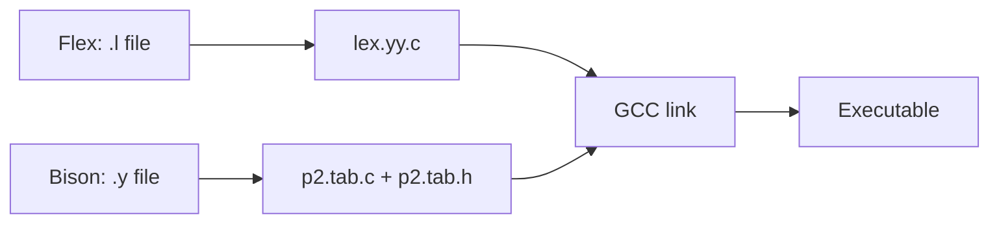

# System Software & Compiler Design — Lab Programs


This repository contains lab exercises and assessments for a System Software & Compiler Design (SSCD) course. The exercises use Flex (lex) and Bison (yacc) to build scanners and parsers, demonstrated on Windows using MSYS2 / UCRT64 toolchains.

## Table of Contents

- **Overview**
- **Tech Stack**
- **Setup (MSYS2 UCRT64)**
- **Compilation Workflow (Flex → Bison → GCC)**
- **Lab Programs (files)**
- **Usage Examples**
- **Assessment Notes**
- **Contributing & Roadmap**

## Overview

- **Purpose:** Hands-on lab programs demonstrating lexical analysis (Flex) and syntax analysis (Bison) for typical compiler-construction tasks: tokenization, expression evaluation, grammar validation, comment stripping, and token counting.
- **Contents:** A set of `.l` (Flex) and `.y` (Bison) source files, alongside some generated `*.tab.c`, `*.tab.h`, and `lex.yy.c` artifacts from previous builds.

## Tech Stack

- **Lex / Flex:** tokenizers written in `.l` files.
- **Bison / Yacc:** parsers written in `.y` files.
- **GCC:** building and linking generated C code.
- **Platform:** Windows with MSYS2 (UCRT64) recommended; works similarly on Linux/macOS with package-equivalents.

## Setup (MSYS2 UCRT64)

1. Install MSYS2 from https://www.msys2.org/ and open the UCRT64 shell.
2. Update package database and core packages:

```bash
pacman -Syu
```

3. Install required development packages:

```bash
pacman -S mingw-w64-ucrt-x86_64-gcc mingw-w64-ucrt-x86_64-flex mingw-w64-ucrt-x86_64-bison make
```

4. From the UCRT64 shell, change to the repository folder:

```bash
cd /c/Users/ajith/Videos/nano_test/SSCD\ lab
```

## Compilation Workflow (Flex → Bison → GCC)

- Typical steps:

```bash
# 1. Run Flex on the .l file (generates lex.yy.c)
flex p2.l

# 2. Run Bison on the .y file (generates parser files and header)
bison -d p2.y    # produces p2.tab.c and p2.tab.h

# 3. Compile and link with GCC
gcc p2.tab.c lex.yy.c -o p2 -lfl

# 4. Run the program
./p2
```

- On MSYS2 UCRT64, you may need to use the mingw-w64 prefix if compiling for native Windows executables:

```bash
mingw32-make # or use gcc from mingw toolchain explicitly
gcc p2.tab.c lex.yy.c -o p2.exe -lfl
```

Diagram: compilation workflow



## Lab Programs (Files & Descriptions)

- `p1.l` ([p1.l](p1.l): checks arithmetic expression validity and counts operands/operators; validates parentheses balance and prints recognized operands and operators.)
- `p2.l` ([p2.l](p2.l): tokenizes integers and arithmetic symbols; provides `NUM` tokens to the parser.)
- `p2.y` ([p2.y](p2.y): Bison grammar to parse and evaluate arithmetic expressions with `+ - * /` and parentheses; prints computed result.)
- `p3.l` ([p3.l](p3.l): simple lexer mapping characters `a` and `b` into tokens `A` and `B`, plus newline handling.)
- `p3.y` ([p3.y](p3.y): grammar validating strings over `A` and `B` (productions: S -> A S | B) and reports "Valid String" on success.)
- `p4.l` ([p4.l](p4.l): comment stripper — counts comment lines (`//` and `/* ... */`) and writes non-comment text to an output file.)
- `p5.l` ([p5.l](p5.l): lexical analyzer printing tokens (operators, digits, keywords, identifiers) and returning token categories to parser.)
- `p5.y` ([p5.y](p5.y): parser that counts occurrences of digits, identifiers, keywords, and operators by driving the analyzer over `p5_input.c`.)

Generated and present artifacts (from previous builds):

- `lex.yy.c` — generated scanner (exists in repository)
- `p2.tab.c`, `p2.tab.h`, `p3.tab.c`, `p3.tab.h`, `p5.tab.c`, `p5.tab.h` — generated parser sources/headers

## Usage Examples

- Evaluate a simple arithmetic expression using `p2` flow:

```bash
flex p2.l
bison -d p2.y
gcc p2.tab.c lex.yy.c -o p2 -lfl
echo "(2+3)*4" | ./p2
```

Expected output:

```
Enter an expression:
Result = 20
```

- Count tokens in `p5_input.c` using `p5` flow:

```bash
flex p5.l
bison -d p5.y
gcc p5.tab.c lex.yy.c -o p5 -lfl
./p5
```

Expected output (example):

```
Digits = <n>
Keywords = <k>
Identifiers = <i>
Operators = <o>
```

## Assessment Notes

- The presence of `p2.tab.c`, `p3.tab.c`, `p5.tab.c` and `lex.yy.c` indicates successful prior runs of `bison`/`flex` on corresponding sources.
- When grading or testing:
    - Ensure token types emitted by `.l` match `%token` declarations in `.y` files (e.g., `NUM`, `DIGIT`, `ID`, `KEY`, `OP`).
    - For `p4.l`, provide input/output filenames when prompted; the program reads an input file and writes stripped output.

## License

- This repository contains course materials; check with the instructor for distribution policy. No explicit license included.
